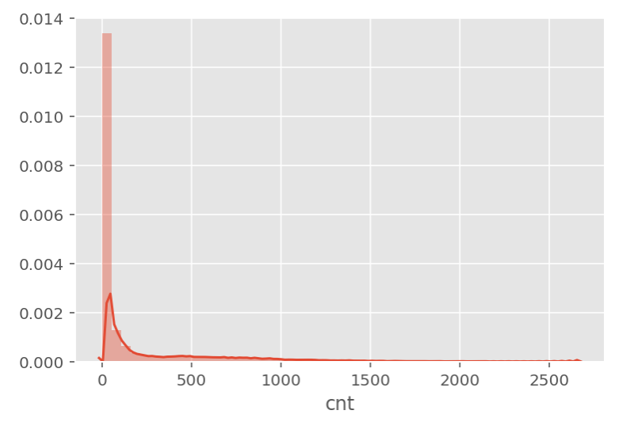
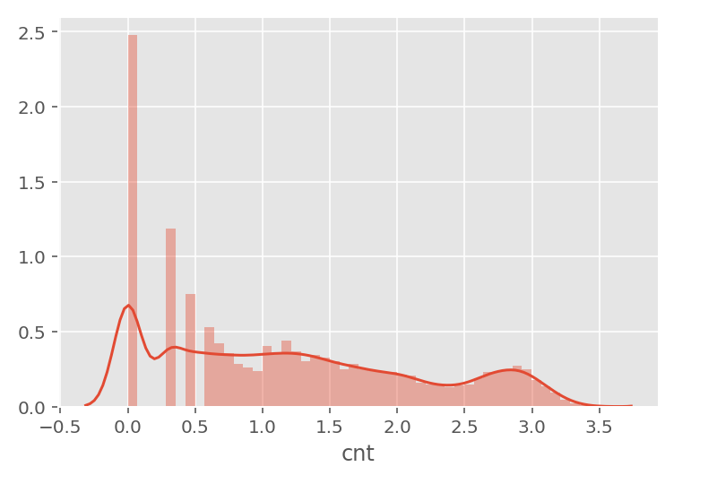
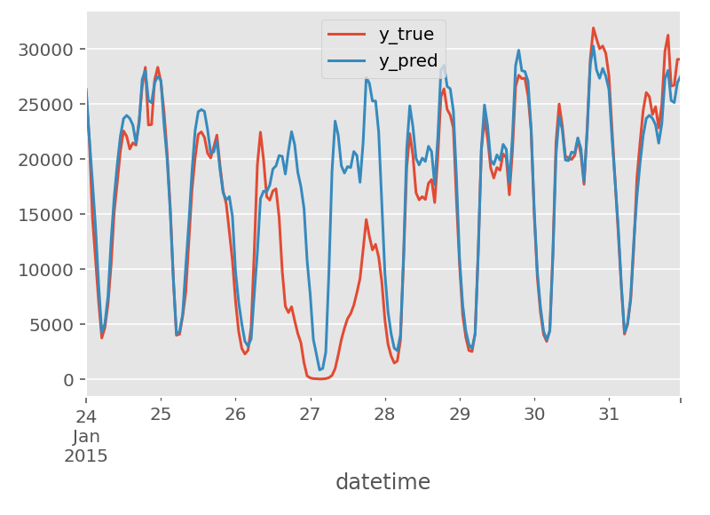
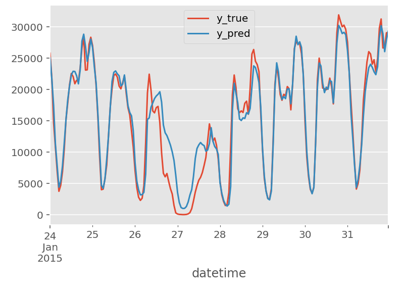
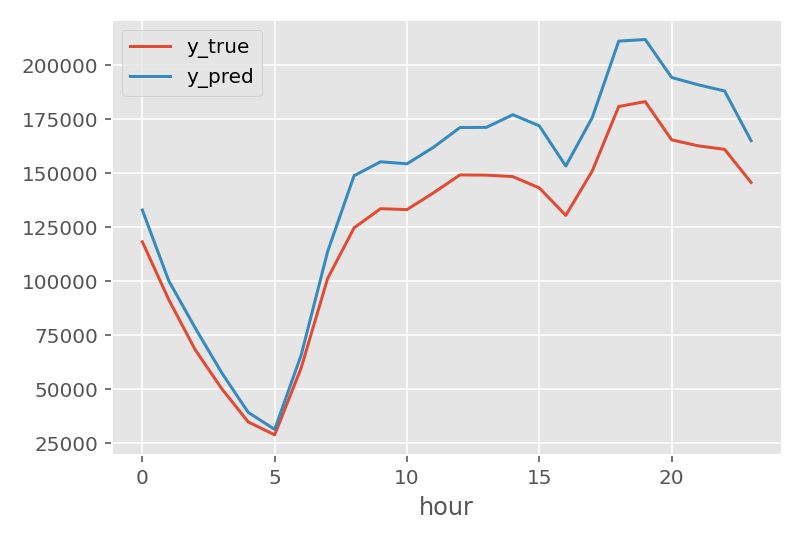
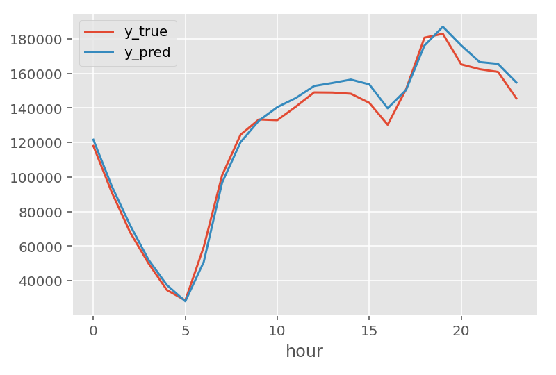

<!-- PROJECT LOGO -->
 

  <!--  -->

<h3 align="center">뉴욕(NYC) 택시 수요 예측 프로젝트</h3>

  

    Random Forest Regressor 모델을 이용해 뉴욕 택시 수요 예측 및 시각화
     
    <!-- <a href="https://github.com/github_username/repo_name"><strong>Explore the docs »</strong></a>
     
     
    <a href="https://github.com/github_username/repo_name">View Demo</a>
    ·
    <a href="https://github.com/github_username/repo_name/issues">Report Bug</a>
    ·
    <a href="https://github.com/github_username/repo_name/issues">Request Feature</a> -->
  

<!-- TABLE OF CONTENTS -->

  
Table of Contents

  <ol>
    <li>
      <a href="#프로젝트-개요">프로젝트 개요</a>
      <ul>
        <li><a href="#📊-분석-방향">분석 방향</a></li>
        <li><a href="#📝-결론">결론</a></li>
      </ul>
    </li>
    <li>
      <a href="#프로젝트-과정">프로젝트 과정</a>
      <ul>
        <li><a href="#문제-소개">문제 소개</a></li>
        <li><a href="#전처리">전처리</a></li>
        <li><a href="#모델-비교">모델 비교</a></li>
        <li><a href="#Feature-Engineering">Feature Engineering</a></li>
        <li><a href="#모델링-결과">모델링 결과</a></li>
      </ul>
    </li>
  </ol>

<!-- ABOUT THE PROJECT -->
## 프로젝트 개요 
뉴욕 택시 수요 예측 알고리즘을 만들어 더 많은 수요가 나올 지역에 택시를 재배치해 수익을 극대화 시킬 수 있는 방법을 찾는 프로젝트입니다.
<!-- [![Product Name Screen Shot][product-screenshot]](https://example.com) -->

<!-- Here's a blank template to get started: To avoid retyping too much info. Do a search and replace with your text editor for the following: `github_username`, `repo_name`, `twitter_handle`, `linkedin_username`, `email_client`, `email`, `project_title`, `project_description` -->

### 📊 분석 방향
- 데이터 수집: BigQuery 공개 데이터셋에서 NYC 택시 이용 로그데이터
- 2015년 1월 데이터 중 학습 데이터는 1\~24일 데이터, 테스트 데이터는 24\~31일 데이터
- 새로운 피쳐 생성: 시간별 lag time (1hr, 24hr, 168hr)
- 모델링: 4개의 모델 중 오차율이 제일 낮은 Random Forest Regressor 사용

### 📝 결론
새로운 피쳐 중 1hr lag의 중요도가 매우 높았으며, 시간의 영향을 많이 받는 것으로 나타났다.\
 
베이스라인 생성 이후, 수요 예측을 해결하기 위한 추가 모델링 모델의 경우 베이스라인에 비해서 수요 예측이 더 정확해진 것을 확인할 수 있다.

(<a href="#readme-top">back to top</a>)

<!-- GETTING STARTED -->
## 프로젝트 과정

2015년 1월 1\~24일 데이터를 학습하여 2015년 1월 24\~31일 수요를 예측하는 모델

### 문제 소개

<table align="center">
  <tr>
    <th>문제 발견</th>
    <td>지역별 택시 공급이 수요와 맞지 않아 수익을 내지 못하는 택시들이 발생</td>
  </tr>
  <tr>
    <th>데이터 소개</th>
    <td>노란 택시 로그 데이터</td>
  </tr>
  <tr>
    <th>목표 설정</th>
    <td>수요 예측에 대한 불확실성 해결</td>
  </tr>
  <tr>
    <th>기대 효과</th>
    <td>지역별 수요에 맞게 택시를 재배치해 수익을 극대화 시킬 수 있다</td>
  </tr>
</table>

(<a href="#readme-top">back to top</a>)

### 전처리

1. 택시 로그 데이터 ➡️ 손님 픽업시간별 수요량을 dataset으로 변환
    - 컬럼명: zipcode, month, day, weekday, hour, is_weekend, cnt
        - weekday: 월 -> 1, 화 -> 2 ... 일요일 -> 7
        - is_weekend: 평일 -> 0, 주말 -> 1

2. 수요가 왼쪽으로 편중 되어 있기 때문에 로그 변환

  
  

    &nbsp;&nbsp;➡️&nbsp;&nbsp;
  

  

(<a href="#readme-top">back to top</a>)

### 모델 비교
1. 평가 척도: MAE, MAPE, MSE 사용
2. 비교 모델: Linear Regression (baseline), XGBoost Regressor, LightGBM, Random Forest Regressor

| Model Name            | MAE    | MAPE    | MSE      |
|-----------------------|--------|---------|----------|
| LinearRegression      | 185.29 | 3190.20 | 78953.34 |
| XGBRegressor          |  57.68 |  538.52 | 16512.33 |
| LGBMRegressor         |  48.24 |  421.69 | 13755.68 |
| RandomForestRegressor |  35.27 |  184.41 | 12195.66 |

3. 메인 모델: 평가 척도 결과가 제일 좋은 Random Froest Regreesor로 결정

(<a href="#readme-top">back to top</a>)

### Feature Engineering
1. 더 좋은 모델을 만들기 위해 feature engineering 진행
2. lagging & rolling: 시간별 lag time (1hr, 24hr, 168hr)과 이동평균 생성

(<a href="#readme-top">back to top</a>)

### 모델링 결과
- Random Forest Regressor (기본) vs Random Forest Regressor (Time Feature 추가)

1. 평가 척도 비교

| Model Name            | MAE    | MAPE    | MSE      |
|-----------------------|--------|---------|----------|
| RandomForestRegressor |  35.27 |  184.41 | 12195.66 |

⬇️

| Model Name            | MAE    | MAPE    | MSE      |
|-----------------------|--------|---------|----------|
| RandomForest(Time Feature) |  6.94 |  NaN | 1022.13 |

2. 'datetime'별 실제 vs 예측 비교

  
  

    &nbsp;&nbsp;➡️&nbsp;&nbsp;
  

  

3. 'hour'별 실제 vs 예측 비교

  
  

    &nbsp;&nbsp;➡️&nbsp;&nbsp;
  

  

4. 결과
    - Time Feature를 추가하였을 때 MAE, MSE 에러가 내려가고 예측면에서도 아주 좋은 결과를 보여줌

(<a href="#readme-top">back to top</a>)

